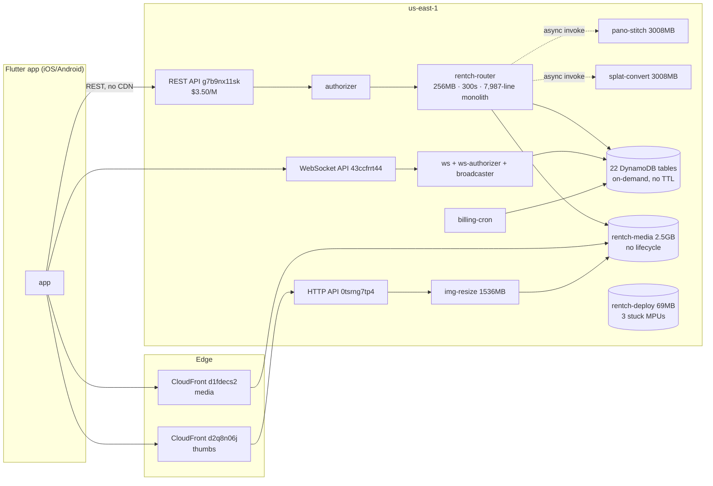

# PHASE 0 — Baseline: Rently AWS (account 543897290879, us-east-1)

Audit date: 2026-08-20 · Auditor access: IAM user `eyalatiyawork@gmail.com` (single profile `default`)
All resources confirmed in **us-east-1 only** (eu-west-1/eu-central-1/us-west-2 probed: 0 functions; il-central-1 not enabled; every billed usage type carries the `USE1-` prefix).

## 1. Headline — the bill is effectively zero

| Measure (last 90 days: 2026-05-22 → 2026-08-20) | Amount |
|---|---|
| **Gross usage cost (RECORD_TYPE=Usage, pre-credit)** | **$0.71** |
| Credits applied | −$0.71 |
| **Net billed** | **$0.00** |

Evidence: `ce get-cost-and-usage` filtered by RECORD_TYPE. Free-tier consumption is also trivial (`freetier get-free-tier-usage`): Lambda requests at 3.4% of the 1M/mo free tier, Lambda GB-s at 0.9%, DynamoDB storage at 0.1% of 25 GB.

**Implication for this audit:** there is no meaningful spend to cut *today* (~$0.24/mo gross). The value of Phases 1–2 is (a) eliminating latent cost bombs that will detonate when traffic scales or credits/free tier lapse, and (b) performance wins on the client↔server path. All savings will be quoted **at a modeled scale** (clearly labeled) plus current-dollar where measurable.

## 2. Cost breakdown — service → usage type (90-day gross)

| Service | 90d $ | % | Dominant usage type | Quantity (90d) |
|---|---|---|---|---|
| API Gateway | $0.34 | 48% | USE1-ApiGatewayRequest (REST, $3.50/M) | 97,228 requests |
| DynamoDB | $0.26 | 36% | WriteRequestUnits $0.167 + ReadRequestUnits $0.093 | 266,639 WRU / 744,613 RRU |
| S3 | $0.11 | 15% | TimedStorage-ByteHrs | ~1.5 GB-mo avg (media now 2.5 GB) |
| Lambda | $0.00 | 0% | 106k requests, 16k GB-s — inside free tier | — |
| CloudWatch, KMS, Glue | ~$0.00 | 0% | negligible | — |

Monthly run rate ≈ **$0.24 gross / $0.00 net**. No RI/SP relevance (zero compute-hour spend). Cost Anomaly Detection: not configured. Tag-based attribution: 0% (no cost-allocation tags activated) — irrelevant at this spend, flagged for guardrails phase.

## 3. Resource inventory (summary — full detail in inventory.csv)

**Compute/serverless:** 9 Lambdas, all x86_64, all nodejs20.x except pano-stitch (python3.12). Monolith: `rentch-router` (256 MB, 300 s timeout, 16.8 MB bundle, ~265 routes in one 7,987-line `index.mjs` — `aws/lambda/router/index.mjs`). Heavy: `pano-stitch` + `splat-convert` at 3,008 MB. No provisioned concurrency anywhere.

**API layer:** 1 REST API (`rentch-api` g7b9nx11sk — the main app API, $3.50/M), 1 HTTP API (`rently-thumb-api`, $1.00/M), 1 WebSocket API (`rentch-ws`). Client default endpoints hard-wired in `lib/core/config/app_config.dart:51` and `lib/core/config/media_cdn.dart:17-23`.

**Data:** 22 DynamoDB tables, all PAY_PER_REQUEST, all TTL **disabled** (incl. ephemeral tables: search-log 9.8k items, events 7.7k, property-views, ws-connections). `rentch-properties` just grew from ~1.5k to ~24k items (22,497 listings loaded 2026-08-20; ItemCount metric still stale at 1,570).

**Storage:** 2 buckets, **no lifecycle rules, no versioning**. `rentch-media` 2.5 GB / 625 objects; `rentch-deploy` 69 MB with **3 incomplete multipart uploads**.

**CDN:** 2 CloudFront distributions — media (d1fdecs2… → media bucket) and thumbs (d2q8n06j… → thumb HTTP API). Main REST API is **not** behind CloudFront.

**Logs:** 9 log groups, **all retention = Never expire**. router 20.3 MB, authorizer 2.5 MB stored.

**Zero-footprint (confirmed absent):** EC2, EBS, NAT GW, EIPs, RDS, ElastiCache, OpenSearch, ECR, SQS, SNS topics, Secrets Manager. The classic top-3 money pits (NAT, EC2, RDS) do not exist here.

**IaC:** SAM-ish `aws/template.yaml` + shell deploy scripts — **known to be badly drifted from prod** (a 2026-07-03 full deploy triggered a CloudFormation rollback that wiped Lambda env secrets). Effective ops mode: console/CLI-managed with code-only zip swaps. Import-to-IaC path will be a recommendation, with the drift called out as a deploy hazard, not a cost item.

## 4. Architecture

## 5. 80/20 anchor

Top three cost centers by gross spend — and the audit anchors on their *scaling behavior*, since today's dollars are ~zero:

1. **API Gateway REST requests** (48%) — every app interaction pays the $3.50/M REST tax; HTTP API is $1.00/M for the same job.
2. **DynamoDB on-demand writes** (36%) — 267k WRU/90d at ~150 items of real data means very high write-amplification per user action (events/search-log/app-state writes on hot paths).
3. **S3/media storage & egress** (15% and compounding) — media grows monotonically; no lifecycle, and originals are stored at full size (2.5 GB for 625 objects ≈ 4 MB/object avg).

## ASSUMPTIONS

- Single production environment; no dev/staging AWS footprint (no separately named resources found) — dev happens against prod tables.
- Credits currently absorb 100% of cost; expiry date not visible via CLI (`not available — requires Billing console`). Modeled-scale numbers assume credits gone.
- Traffic model for projections: current 97k API req/90d ≈ 32k/mo ≈ a handful of active users. "Scale" scenario = 5,000 MAU × 300 req/user/mo = 1.5M req/mo (labeled wherever used).
